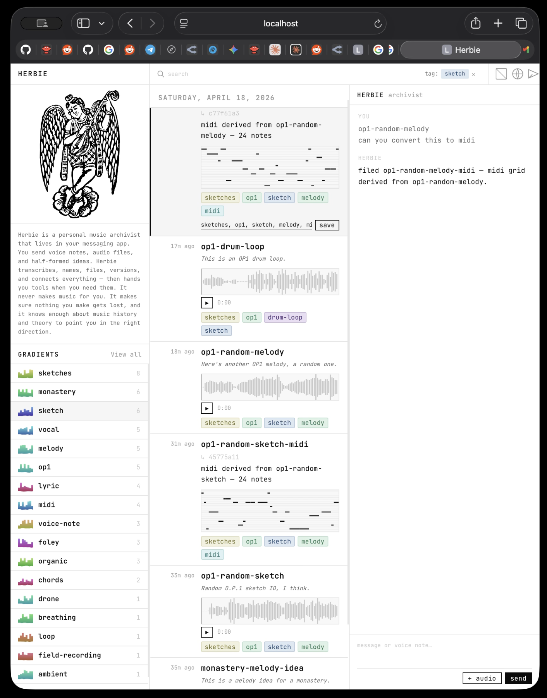

# Lila



Lila is a personal music archivist that lives in your messaging app. You
send voice notes, audio files, and half-formed ideas. Lila transcribes,
names, files, versions, and connects everything — then hands you tools when
you need them. It never makes music for you. It makes sure nothing you make
gets lost, and it knows enough about music history and theory to point you
in the right direction.

---

## Architecture

The system is organized in three phases: **capture → archive → retrieval.**

```
YOU
 │
 ├── voice note ─┐
 ├── text ───────┼──► LILA ──┬─► object store   (raw files + sidecars)
 └── job request ┘             ├─► event log      (append-only)
                               └─► job queue      (pending → done)
```

### Capture

The Telegram bot is the primary ingest surface for voice notes, audio files,
and text fragments. On submission, Lila transcribes the audio via
faster-whisper, generates a semantic slug, and derives tags from the
transcript, any user-supplied context, and recent conversation history.
Explicit framing in the voice note ("possible monastery lyrics") is picked
up verbatim; otherwise the LLM selects tags from the palette defined in
`soul.md`.

### Archive

Entries are flat. There is no project / song / version hierarchy. Each
entry carries a set of tags across four dimensions:

```
content type:  foley, voice-note, sketch, loop, drone, sample, lyric, midi, stem
texture/mood:  organic, harsh, warm, granular, glitchy, sparse, dense
source/origin: op1, field-recording, youtube, synth, vocal, guitar
song/project:  hospital, monastery, brutalist-ep (when known)
```

A "project view" is a filtered query built on demand, not a folder. Every
mutation — rename, retag, move, delete — is appended to `events.jsonl`; no
record is ever destructively overwritten.

This supports a capture workflow where entries are filed tentatively
(`possible-monastery`, `random-poetry`) and later consolidated under a
stable song tag via the `retag_entries` tool once the identity is clear.

### Retrieval

The web UI renders the event log as a reverse-chronological feed with tag
filters, inline transcript editing, and instant client-side search over
slugs, transcripts, and tags. Audio entries render as WaveSurfer waveforms;
MIDI entries render as a piano-roll canvas derived from the stored `NOTE`
data. Each entry supports:

- Drag-and-drop into a DAW (audio or `.mid`)
- "Reveal in Finder / Explorer"
- Inline playback from chat via the `[[audio:<file_id>]]` marker

---

## Tool-based LLM integration

The LLM does not receive an archive snapshot in its system prompt. It
accesses the archive through a small tool surface:

| Tool | Purpose |
| --- | --- |
| `list_entries(tag?, limit?)` | Metadata for recent entries |
| `read_entries(tag?, limit?)` | Metadata + full text / transcript / NOTE data |
| `file_text(text, slug, tags)` | File a new lyric / note / fragment |
| `retag_entries(file_ids, add?, remove?, replace?)` | Batch retag consolidation |
| `queue_job(job_type, ...)` | Side-effect jobs that create new files |

`respond_to_text` runs a multi-turn tool loop (capped at four rounds). The
model may call a read tool, receive the data as a tool result, reason over
it, and produce a natural-language reply. For example, "what key is
`op1-pretty-random-loop` in?" triggers a `read_entries` call; the tool
result includes the `NOTE pitch start_sec dur_sec` list, and the model
performs key analysis directly over those pitches.

---

## Repo layout

```
main.py                 FastAPI server + static UI
telegram_bot.py         Telegram transport
services/
  archive.py            event log, sidecars, raw storage, soft delete
  llm.py                OpenRouter client, tools, multi-turn loop
  jobs.py               job handlers (to_midi, stem_split, render_chords, …)
  transcribe.py         faster-whisper
static/
  index.html            feed UI with waveform/MIDI rendering, drag-to-DAW
  angel.svg             sidebar art
soul.md                 system prompt — the living style guide
improvements.md         feedback backlog, folded into soul.md over time
archive/                (gitignored)
  raw/{id}.{ext}        immutable originals
  sidecars/{id}.json    per-entry metadata
  events.jsonl          append-only event log — source of truth
  jobs/{job_id}.json    job records
```

---

## Setup

```bash
git clone https://github.com/botforge/lila.git
cd lila
python -m venv .venv && source .venv/bin/activate
pip install -r requirements.txt
cp .env.example .env         # or create one — see below
cp -r demo archive           # optional — load the sample archive
```

The `demo/` folder is a frozen snapshot of a working archive (voice notes,
lyric entries, MIDI derivations) included so that a fresh clone presents a
populated feed. Copying it into `archive/` is optional; omit that step to
start with an empty archive.

`.env`:

```
OPENROUTER_API_KEY=sk-or-v1-...
MODEL=anthropic/claude-haiku-4-5   # or any OpenRouter model
ARCHIVE_PATH=./archive
TELEGRAM_BOT_TOKEN=...              # optional, for the Telegram bot
TELEGRAM_ALLOWED_USER_ID=12345      # optional, restrict the bot to you
```

**Run the web UI + API:**
```bash
python main.py
# open http://localhost:8000
```

**Run the Telegram bot** (separate terminal, same `.env`):
```bash
python telegram_bot.py
```

Both processes share the same `archive/` directory and the same `services/`
layer, so entries captured via Telegram are visible in the web feed on
refresh and vice versa.

---

## Jobs

Jobs are side-effect actions that create new archive entries. The LLM triggers
them via `queue_job`; they execute synchronously and inherit tags from the
parent file.

| Job | Input | Output | Status |
| --- | --- | --- | --- |
| `to_midi` | audio `file_id` | text entry with `midi_notes` | stub (random notes) |
| `render_chords` | `chords=['Em','Am','D','G']` | text entry with real MIDI notes | real |
| `stem_split` | audio `file_id` | 4 audio entries (vocals/bass/drums/other) | stub (copies original) |
| `autotune` | audio `file_id` | audio entry tagged `tuned` | stub (copies original) |
| `transpose` | audio `file_id`, `semitones` | audio entry tagged `transposed-upN` | stub (copies original) |

Everything above the job handlers — tag inheritance, derived-filename
conventions, UI rendering, drag-to-DAW, the `[[audio:…]]` marker system — is
validated end-to-end. Real DSP slots in by swapping the body of each handler in
`services/jobs.py`.

---

## Prompt management

The system prompt (`soul.md`) is treated as a first-class artifact rather
than static configuration. User feedback on tone and behavior — what to
quote verbatim, when to offer analysis, how mood descriptors must be
anchored to a specific reference and a YouTube link — is captured in
`improvements.md` and folded into `soul.md` as explicit rules with
examples. The prompt encodes voice and taste; the code encodes workflow.

---

## Inline audio playback

The `[[audio:<file_id>]]` token in any LLM reply is rewritten per transport:

- **Web UI** — inline WaveSurfer waveform with a play button
- **Telegram bot** — `sendDocument` attachment with the original filename
  preserved, so the file can be forwarded into a DAW

The same LLM output string therefore produces playable audio on either
surface.

---

## What I would do differently

**Real DSP in the job handlers.** The current handlers stub the end-to-end
wiring: `to_midi` emits random notes, `stem_split` returns four copies of the
source, `autotune` and `transpose` pass the input through unchanged. A real
build would swap in Demucs for stem separation, Rubber Band for pitch and
time manipulation, Librosa beat tracking together with Basic Pitch for
audio-to-MIDI, and — for `render_chords` — a CLAP-embedding pipeline that
infers key and tempo from the source before generating voicings.

**Asynchronous job execution.** Jobs run synchronously inside the request
handler. A production deployment would back them with a proper queue
(Celery or RQ on Redis), expose a `pending → running → done / failed` state
machine, stream handler logs, and render a per-entry progress indicator in
the UI. The job records already exist on disk; only the runner changes.

**First-class versioning and branching.** The event log already captures the
full history of every entry, but the web UI does not yet surface it. A "v2"
lyric is simply another append with the same slug. A proper version browser
would expose a per-slug history tree, support side-by-side diffs between
takes, and let the user branch from an earlier version without losing the
intermediate work.

**Content-addressed audio storage.** Every derivation currently copies the
parent file — a stem split of a ten-minute take consumes roughly 40 MB of
redundant storage. A content-addressed blob store keyed on file hash, with
sidecars holding only pointers, would deduplicate audio across derivations
and across repeat ingests of the same source.

**Tighter tool loop and prompt caching.** The multi-turn tool pattern is
correct but verbose. The system prompt plus `soul.md` is constant across
every call and should be cached upstream. `read_entries` payloads should be
truncated adaptively so a summarize query over a large project does not
exceed the context window.

**Automated test coverage.** The flat event log makes integration testing
straightforward: spin up a temporary archive root, replay a scripted
sequence of ingests and tool calls, and assert on the resulting feed state.
Roughly thirty tests — covering ingest, retag, delete, summarize, and each
job type — would be a reasonable floor.

**Prompt eval harness.** `soul.md` was iterated by hand: send a message,
inspect the reply, edit the prompt, repeat. A representative set of a dozen
user turns — "summarize X", "edit these lyrics to Y", "what key is this
in?", "retag everything about the breath motif" — run as regressions on
every prompt change would catch tone drift and tool-use regressions before
they reach the user.

---

## External tools, libraries, and services

### AI / model inference

| | |
| --- | --- |
| **OpenRouter** | Single HTTPS endpoint used for every LLM call (chat + tool use). The default `MODEL` is configurable via `.env` — development primarily used `anthropic/claude-haiku-4-5`. |
| **openai Python SDK** | Client library used to talk to OpenRouter (its API is OpenAI-compatible). Drives both `respond_to_audio` and the multi-turn tool loop in `services/llm.py`. |
| **faster-whisper** | Local audio transcription. Base model, int8 quantization, CPU inference. Runs lazily on first voice-note ingest. |

### Backend

| | |
| --- | --- |
| **FastAPI** | HTTP server, routes, request/response shapes. |
| **Uvicorn** | ASGI process running the FastAPI app with hot reload. |
| **Pydantic** | Request body validation (`TextRequest`, `JobRequest`, `PatchFileRequest`). |
| **python-telegram-bot** | Telegram Bot API wrapper used by `telegram_bot.py` — `reply_text`, `reply_voice`, `reply_document`, `reply_audio`. |
| **python-dotenv** | `.env` loading at service boot. |
| **librosa + numpy + scipy** | Key detection (Krumhansl–Schmuckler) and BPM estimation in `services/analyze.py`. Currently orphaned — left in place for the v2 audio-feature pipeline described in "What I would do differently". |

### Frontend

| | |
| --- | --- |
| **WaveSurfer.js v7** | Inline audio waveforms in the feed and chat. Loaded via CDN (`unpkg.com`). Drives the per-entry player, the chat playback markers, and the "pause others on play" coordination. |
| **JetBrains Mono** | Web font fallback for DejaVu Sans Mono, served from Google Fonts. |
| **Plain HTML + CSS + vanilla JS** | No framework, no bundler. Single-file `static/index.html`. |

### OS integration

| | |
| --- | --- |
| **`open -R` / `explorer /select,` / `xdg-open`** | `POST /files/{id}/reveal` shells out to the platform file manager so the user can grab the raw file. |
| **Chrome `DownloadURL` drag protocol** | Drag payload on draggable entries so DAWs on Chromium-based browsers materialize a real file instead of a URL shortcut. |

### Standards implemented directly

| | |
| --- | --- |
| **Standard MIDI File (SMF) format 0** | `notes_text_to_midi_bytes` in `services/jobs.py` writes `.mid` bytes by hand from the stored `NOTE` text (variable-length delta encoding, tempo meta event, 480 PPQN). No external MIDI library needed. |
| **Chord parser** | Root + quality parser in `services/jobs.py` handling triads, sevenths, suspensions, diminished, augmented, and slash-chord bass stripping. |
